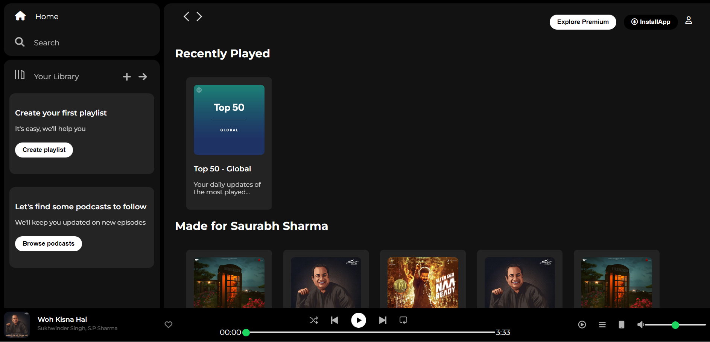
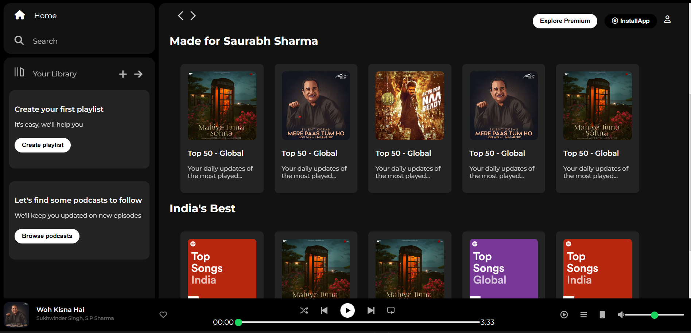

# Spotify Clone

This project is a clone of the Spotify web player, implemented using HTML and CSS.

## Preview

## Usage

1. Clone this repository to your local machine.
2. Open the `index.html` file in your web browser to view the Spotify clone.
3. Navigate through different sections such as Home, Search, Your Library, and more using the sidebar menu.
4. Explore various playlists and albums in the "Recently Played", "Made for You", and "India's Best" sections.
5. Play music tracks using the music player controls at the bottom.

## Features

- Responsive design suitable for various screen sizes.
- Sidebar navigation menu for easy access to different sections.
- Display of recently played tracks and recommended playlists.
- Music player controls for playback, volume adjustment, and progress tracking.

## Credits

- Font Awesome - Icons
- Google Fonts - Montserrat, Poppins, Roboto

